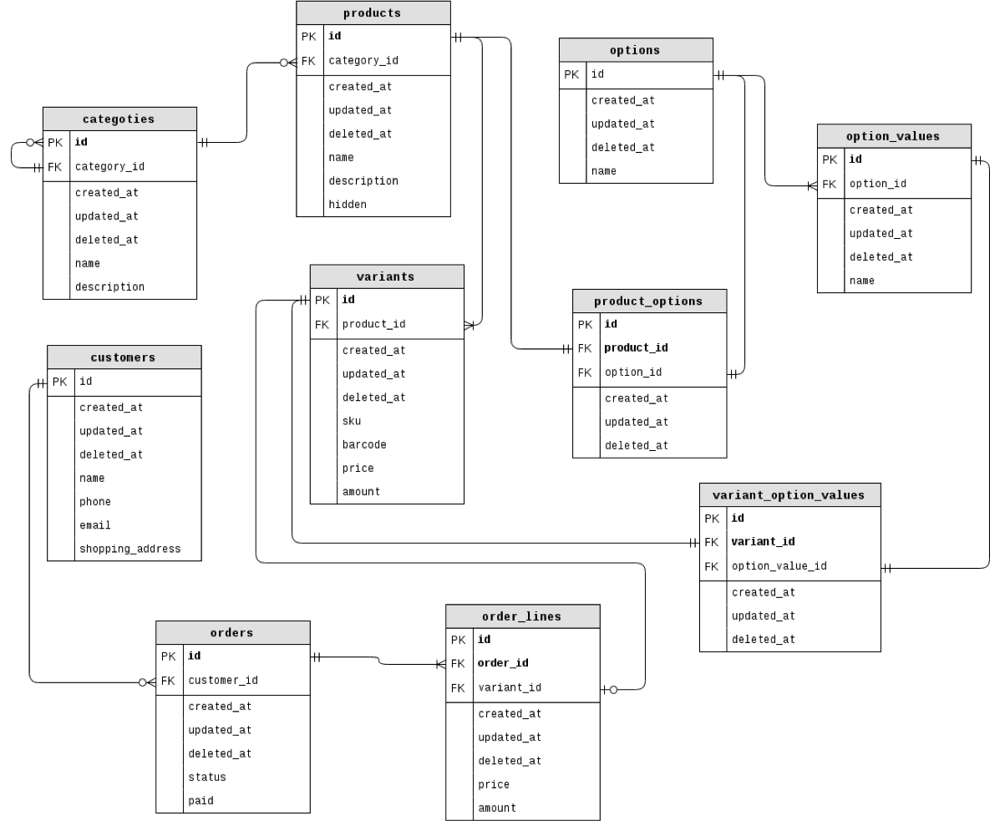

# diht-databases

### Моя проектная работа в рамках курса "Базы Данных" на ФИВТе

-	Интернет-магазин;  
-	Изначально позиционировался как интернет-магазин электронных товаров, но в процессе разработки стало ясно, что полученный результат довольно универсален и может использоваться не только для продажи девайсов (на самом деле от этого пришлось отказаться, когда выяснилось, что библиотека [Faker](https://github.com/stympy/faker), используемая в проекте для генерации данных для базы, не может генерировать ничего связанного с электроникой, зато может в котов, собак, пиво и cannabis);  
-	База данных содержит множество товаров, распределенных по категориям, список заказов и информацию по ним;  
-	Для каждого товара определены конкретные его варианты (сборки). Например, для товара `“MacBook Pro”` могут существовать варианты `“MacBook Pro 13 Retina display Mid 2017”` и `“MacBook Pro 15 Retina display Mid 2015”`, где `(13, 15)` – опция `«Размер дисплея»`; (`“Retina display”`) – опция `«Тип дисплея»`; (`“Mid 2017”, “Mid 2015”`) – время выпуска.  

+ [Реализация базы данных интернет-магазина](https://github.com/alenmarz/diht-databases/blob/master/shop.sql)
+ [Cкрипт для ее создания и заполнения](https://github.com/alenmarz/diht-databases/blob/master/Rakefile)
+ [Несколько sql-запросов](https://github.com/alenmarz/diht-databases/blob/master/my.sql)
